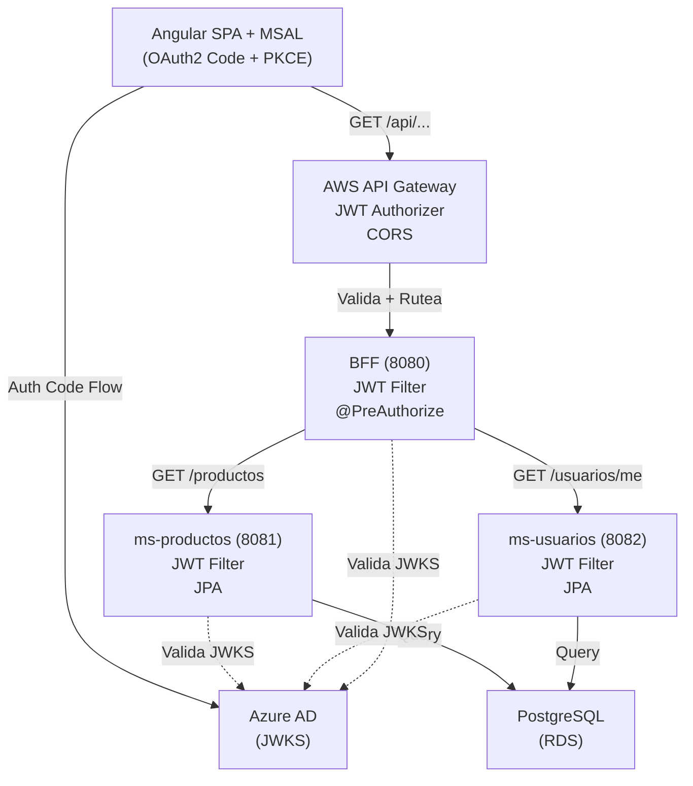

# ARCHITECTURE — Tienda de Perritos Cloud Native

**Asignatura**: DSY1107 – Desarrollo Cloud Native I  
**Estudiante**: [Tu nombre]  
**Fecha**: 2026-01-09

---

## 1. Decisiones Técnicas Confirmadas

### 1.1 Estructura de Repositorios
- **Enfoque**: Repos separados, organizados en carpeta única local
- **Por qué**: Simula equipos independientes, facilita CI/CD, respeta pauta de "enlaces GitHub" (plural)
- **Estructura local**:
  ```
  tienda-perritos/
  ├── tienda-perritos-angular/       # Frontend (React o Angular)
  ├── tienda-perritos-bff/           # Backend for Frontend (Spring Boot 3.3)
  ├── tienda-perritos-ms-productos/  # Microservicio productos (Spring Boot 3.3)
  ├── tienda-perritos-ms-usuarios/   # Microservicio usuarios (Spring Boot 3.3)
  └── README.md                      # Índice general
  ```

### 1.2 Base de Datos
- **Motor**: PostgreSQL 15+ (AWS RDS)
- **Estrategia**: BD única compartida por todos los microservicios
- **Por qué**: Simplifica EP1, reduce costo, mantiene consistencia eventual
- **Tablas principales**:
  - `productos` (id, nombre, descripcion, precio, stock, created_at, updated_at)
  - `usuarios` (id, email, nombre, apellido, roles, created_at, updated_at)
  - `producto_roles_acceso` (producto_id, rol, created_at) — para autorización granular si aplica

### 1.3 Microservicios
- **ms-productos**: CRUD de productos, validación JWT, integración con BD
- **ms-usuarios**: Gestión de usuarios, lectura de Azure AD claims, integración con BD
- **BFF**: Orquestador central, validación JWT dual, enrutamiento, autorización por roles
- **Arquitectura**: Cada MS con capas (controller, service, repository, entity, dto, config, security, exception)

### 1.4 Deployment Backend
- **Plataforma**: AWS EC2 (instancia única para MVP)
- **Orquestación**: Docker Compose (en EC2)
- **Services**:
  - `bff` (Spring Boot, puerto 8080)
  - `ms-productos` (Spring Boot, puerto 8081)
  - `ms-usuarios` (Spring Boot, puerto 8082)
  - `postgres` (PostgreSQL, puerto 5432)
- **Por qué**: Más simple que EKS para EP1, suficiente para demostración

### 1.5 Frontend Hosting
- **Plataforma**: AWS S3 + CloudFront (CDN)
- **Compilación**: Angular build -> S3 bucket -> CloudFront distribution
- **Por qué**: Costo mínimo, fácil de actualizar, rápido

### 1.6 Build Tool & Framework
- **Build**: Maven 3.9+ (multi-módulo opcional, aquí repos separados)
- **Spring Boot**: 3.3+ (Java 21+)
- **Dependencias principales**:
  - spring-boot-starter-web
  - spring-boot-starter-data-jpa
  - spring-boot-starter-security
  - spring-boot-starter-oauth2-resource-server
  - postgresql driver
  - com.auth0:java-jwt (para validación manual si necesario)
  - lombok (reducir boilerplate)
  - springdoc-openapi (OpenAPI/Swagger)

### 1.7 Autorización (Roles/Permisos)
- **Modelo**: Basado en roles de Azure AD claims
- **Roles sugeridos**:
  - `ROLE_ADMIN`: lectura/escritura en productos y usuarios
  - `ROLE_USER`: lectura de productos, cambio de perfil propio
  - `ROLE_GUEST`: solo lectura de productos (sin crear, editar, eliminar)
- **Validación**: JWT Filter del BFF extrae roles de `roles` claim y aplica `@PreAuthorize` en controladores
- **Ejemplo**:
  ```java
  @PostMapping("/productos")
  @PreAuthorize("hasRole('ADMIN')")
  public ResponseEntity<ProductoDto> crearProducto(...) { ... }
  ```

### 1.8 AWS Region
- **Region**: us-east-1 (N. Virginia)
- **Por qué**: Disponibilidad en Free Tier, máx documentación, menor latencia para estudiantes US/Latinoamérica

---

## 2. Flujo de Autenticación & Autorización

```
┌─────────────────────────────────────────────────────────────┐
│ Angular SPA (MSAL)                                          │
│ User clicks login → PKCE flow → obtiene JWT de Azure AD    │
└────────────────────┬────────────────────────────────────────┘
                     │ Authorization: Bearer <JWT>
                     v
┌─────────────────────────────────────────────────────────────┐
│ AWS API Gateway                                             │
│ - JWT Authorizer valida issuer/audience               │
│ - CORS headers verificados                            │
│ - Rutea a BFF endpoint                                │
└────────────────────┬────────────────────────────────────────┘
                     │ (BFF se sigue validando)
                     v
┌─────────────────────────────────────────────────────────────┐
│ BFF (Spring Boot)                                           │
│ - JWT Filter extrae token                            │
│ - Valida issuer, audience, firma, expiración         │
│ - Extrae roles del claim "roles"                      │
│ - @PreAuthorize verifica permisos                    │
│ - Llama a ms-productos o ms-usuarios                 │
└────────────────────┬────────────────────────────────────────┘
                     │ (Authentication header incluido)
                     v
┌─────────────────────────────────────────────────────────────┐
│ Microservicios (ms-productos, ms-usuarios)                 │
│ - JWT Filter valida token nuevamente                │
│ - Endpoints públicos (ej GET /productos) sin filtro │
│ - Endpoints protegidos (POST, PUT, DELETE) con roles │
└────────────────────┬────────────────────────────────────────┘
                     │
                     v
             PostgreSQL (BD única)
```

**Validación JWT Dual** (criterio rúbrica EP1, 40%):
- **Nivel 1 (API Gateway)**: Valida token firmado por Azure AD
- **Nivel 2 (BFF)**: Valida nuevamente issuer, audience, firma, expiración, roles
- **Microservicios**: Validan también (defensa en profundidad)

---

## 3. Endpoints & Scopes Esperados

### ms-productos
```
GET    /api/v1/productos              → ROLE_GUEST, ROLE_USER, ROLE_ADMIN
POST   /api/v1/productos              → ROLE_ADMIN
GET    /api/v1/productos/{id}         → ROLE_GUEST, ROLE_USER, ROLE_ADMIN
PUT    /api/v1/productos/{id}         → ROLE_ADMIN
DELETE /api/v1/productos/{id}         → ROLE_ADMIN
```

### ms-usuarios
```
GET    /api/v1/usuarios/me            → Authenticated (cualquier rol)
GET    /api/v1/usuarios/{id}          → ROLE_ADMIN
PUT    /api/v1/usuarios/me            → Authenticated
PUT    /api/v1/usuarios/{id}          → ROLE_ADMIN
DELETE /api/v1/usuarios/{id}          → ROLE_ADMIN
```

### BFF
```
GET    /api/v1/dashboard              → Authenticated (agrega data de múltiples MS)
POST   /api/v1/auth/me                → Authenticated (retorna user info + roles)
```

---

## 4. Variables de Entorno & Placeholders

### Backend (.env o application-prod.yml)
```properties
# Azure AD / OIDC
SPRING_SECURITY_OAUTH2_RESOURCESERVER_JWT_ISSUER_URI=https://login.microsoftonline.com/<TENANT_ID>/v2.0
SPRING_SECURITY_OAUTH2_RESOURCESERVER_JWT_JWK_SET_URI=https://login.microsoftonline.com/<TENANT_ID>/discovery/v2.0/keys

# Database
SPRING_DATASOURCE_URL=jdbc:postgresql://<RDS_ENDPOINT>:5432/<DB_NAME>
SPRING_DATASOURCE_USERNAME=<DB_USER>
SPRING_DATASOURCE_PASSWORD=<DB_PASSWORD>
SPRING_JPA_PROPERTIES_HIBERNATE_DIALECT=org.hibernate.dialect.PostgreSQLDialect

# Microservices URLs (para BFF)
MS_PRODUCTOS_URL=http://ms-productos:8081
MS_USUARIOS_URL=http://ms-usuarios:8082

# Logging
LOGGING_LEVEL_COM_TIENDA=DEBUG
```

### Frontend (environment.ts)
```typescript
export const environment = {
  production: false,
  apiGatewayUrl: 'https://<API_GATEWAY_ID>.execute-api.us-east-1.amazonaws.com/prod',
  msalConfig: {
    auth: {
      clientId: '<CLIENT_ID>',
      authority: 'https://login.microsoftonline.com/<TENANT_ID>',
      redirectUri: 'https://<CLOUDFRONT_DOMAIN>/auth/callback',
    },
    cache: { cacheLocation: 'localStorage' },
  },
};
```

---

## 5. Decisiones sobre Seguridad

### JWT Validation
- Usar Spring Security OAuth2 Resource Server con `spring-boot-starter-oauth2-resource-server`
- Configurar JWKS endpoint de Azure AD
- Extraer claims: `sub` (usuario), `roles` (array de roles), `aud` (audience)

### CORS
- BFF: permitir origen del frontend (S3 CloudFront domain)
- API Gateway: configurar stage settings con CORS headers

### Secrets Management
- Variables de entorno en EC2 (o AWS Secrets Manager para prod)
- No hardcodear en código fuente
- `.gitignore` debe excluir archivos `.env`, `.properties` con credentials

---

## 6. Testing Strategy

### Backend
- **Unitarios**: JUnit 5 + Mockito (servicios, validadores)
- **Seguridad**: Tests de JWT Filter con tokens mockeados (válido, expirado, inválido, sin scope)
- **Integración**: @SpringBootTest + TestContainers (PostgreSQL en Docker)

### Frontend
- **Unitarios**: Jasmine/Karma para servicios
- **E2E**: Opcional para EP1 (Cypress/Protractor)

---

## 7. CI/CD Pipeline

### GitHub Actions (build + test)
- Trigger: push a main/develop
- Pasos:
  1. Checkout código
  2. Setup Maven/Java 21
  3. Run `mvn clean package` (backend)
  4. Run tests (JUnit)
  5. Build Docker image (opcional, para push a ECR)
  6. Report results

**Nota**: Deployment a EC2 y API Gateway se documenta en `README-DEPLOY.md` (pasos manuales)

---

## 8. Próximos Pasos

1. ✅ Crear estructura de carpetas base
2. ✅ Crear `.gitignore` para Maven + Angular
3. ➡️ **ms-productos** (Phase 2): Entity, Repository, Service, Controller (sin seguridad aún)
4. ➡️ **ms-usuarios** (Phase 2)
5. ➡️ Agregar JWT Filters en ambos MS
6. ➡️ BFF + orquestación
7. ➡️ Angular + MSAL
8. ➡️ Docker Compose
9. ➡️ README-DEPLOY.md

---

**Diagrama Mermaid de Arquitectura** (para referencia):

